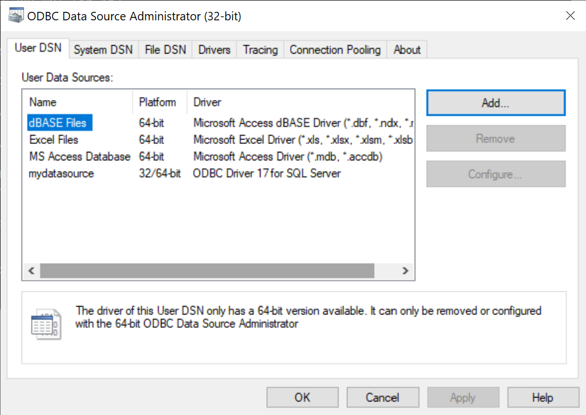
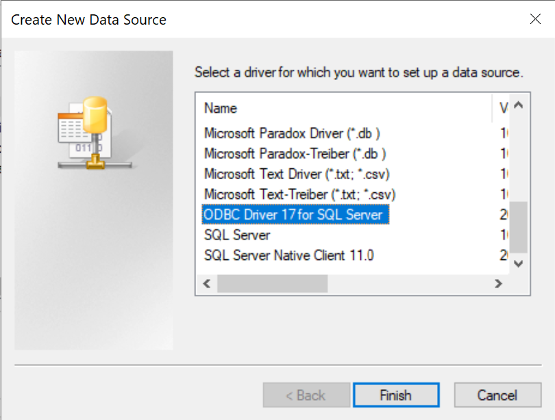
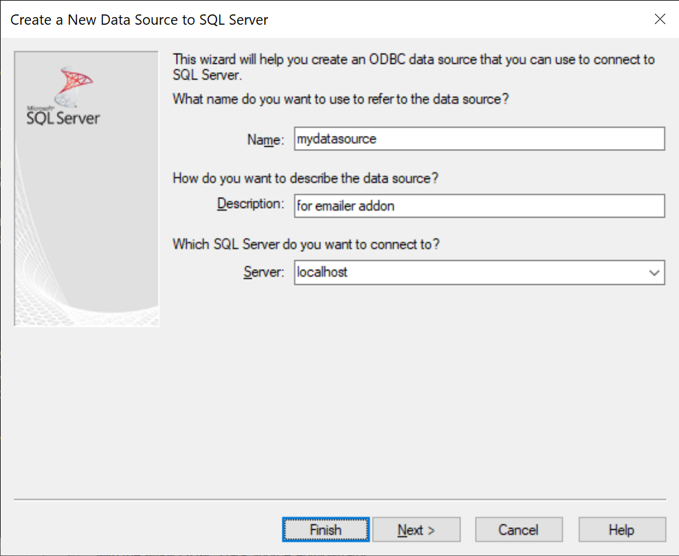
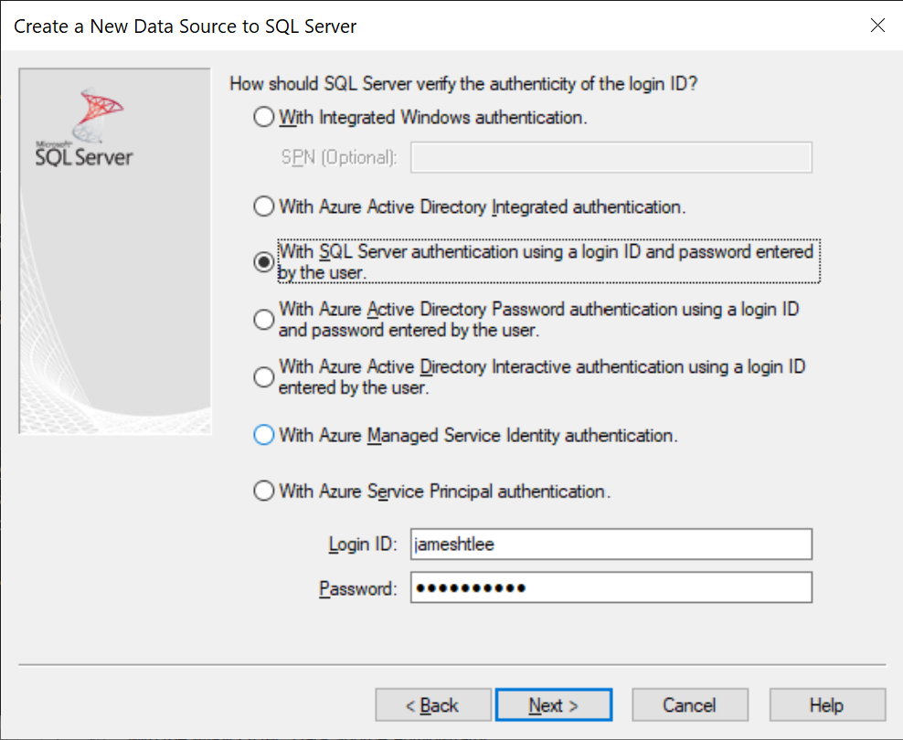
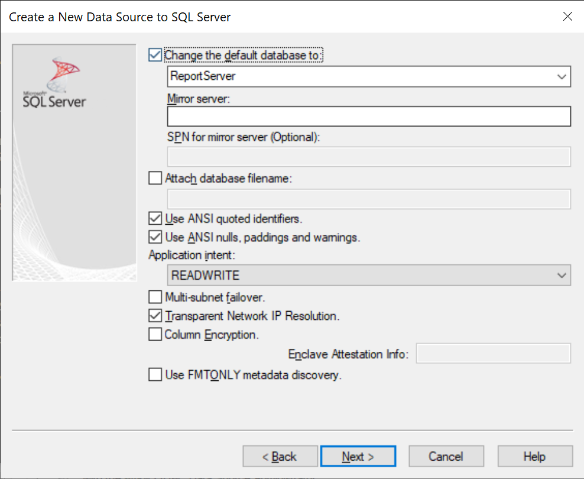
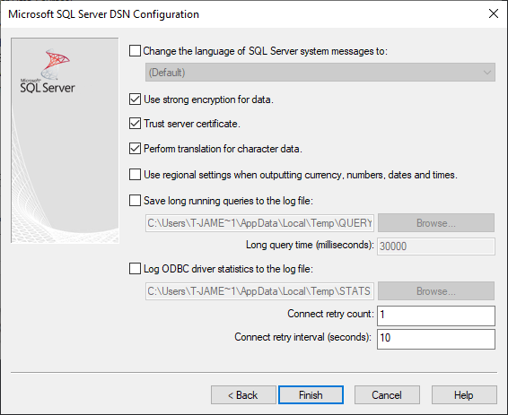

# Email Alerts addon for Power BI Report Server

Script to enable email alerts for cache refresh and timed subscription events in PowerBI Report Server.

## Requirements
- Python3
- venv (recommended)
- Install dependencies:

```
python3 -m venv env
.\env\Scripts\activate
pip install requirements.txt
```

## Setup connection
Go to the *ODBC data sources* program in Windows to create a new data source.

1. 




2. 


3. 


4.


5.


## Configure addon
Modify the `config.json` file to set
1. DSN name (e.g. mydatasource)
2. Email account for sending
3. Email recepients

Parameters for email recepients:
| Parameter | Values | Description |
| - | - | - |
| event_type | `RefreshCache`, `TimedSubscription` |
| recepient_list | Valid email address | |
| last_status_type_like | `succeeded`, `failed` |
| email_profile_name | String | |
| email_template | relative filepath to HTML file | |
| date_add | datetime |  |

## Final steps
- When email needs to be sent, run the stored procedure in the database
- Alternatively, [create scheduled job to run the stored procedure through SSMS](https://docs.microsoft.com/en-us/sql/ssms/agent/schedule-a-job?view=sql-server-ver15)

## Run
```
python main.py
```

**NOTE**: 

- The script will replace all rows in the `EmailRecepients` table based on the JSON config.

- If a new email account is configured, it will be added to the current list of email accounts in the database.

- Tables created during setup will not be overrided and will just be ignored.

To do a full reset, run `EmailerDrop.sql` in your database.
